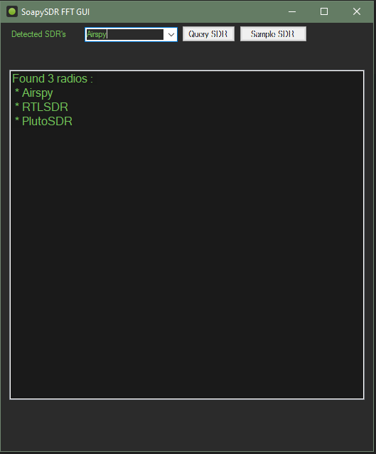
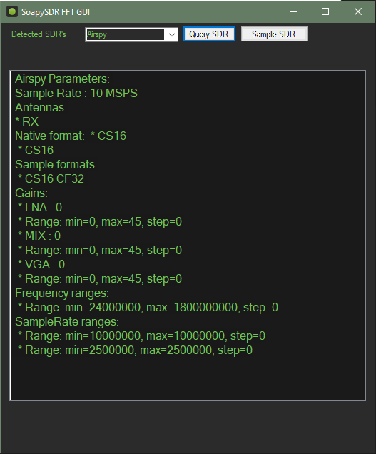
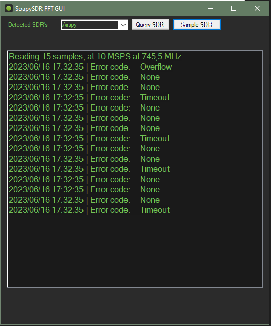

# SoapySDR-FFT-GUI

SoapySDR FFT viewer(in progress)

## Supports these modules atm: 

 - Airspy
 - RTLSDR
 - PlutoSDR
 - SDRPlay 

### Initial Device enumeration

### Query SDR device

### Read 15 samples

### TO DO :

  - MSI installer
    - Adds Resources/SoapySDR to Program Files/SoapySDR
    - Adds environment variable SOAPY_SDR_ROOT
    - Optionally add to PATH..
  - Interface
    - [x] List available sample rates
    - Gain slider(s)
    - PlutoSDR
      - Network address box
      - Auto discovery?
    - [x] Connect to RX stream 
    - Draw spectrum window 
  - More to come . . .