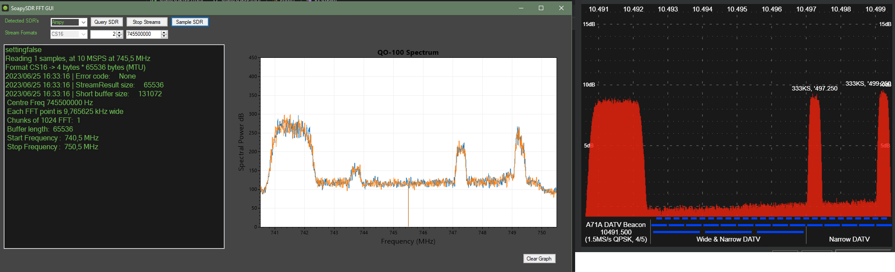

# SoapySDR-FFT-GUI

SoapySDR FFT viewer(in progress)

## Supports these modules atm: 

 - Airspy
 - RTLSDR
 - PlutoSDR
 - SDRPlay 

### Program sample

### TO DO :

### Install instructions in powershell admin

```shell
.\install.ps1
Set SOAPY_SDR_ROOT environment variable to : C:\git\SoapySDR-FFT-GUI\SoapySDRFFTGUI\Resources\SoapySDR
Set C:\git\SoapySDR-FFT-GUI\SoapySDRFFTGUI\Resources\SoapySDR\bin in PATH
Restart Powershell and use soapySDRUtil --info
```
### Run soapySDRUtil --info testing install
```shell
soapySDRUtil --info
######################################################
##     Soapy SDR -- the SDR abstraction library     ##
######################################################

Lib Version: v0.8.1-gbb33b2d2
API Version: v0.8.200
ABI Version: v0.8-3
Install root: C:\git\SoapySDR-FFT-GUI\SoapySDRFFTGUI\Resources\SoapySDR
Search path:  C:\git\SoapySDR-FFT-GUI\SoapySDRFFTGUI\Resources\SoapySDR/lib/SoapySDR/modules0.8-3
Module found: C:\git\SoapySDR-FFT-GUI\SoapySDRFFTGUI\Resources\SoapySDR/lib/SoapySDR/modules0.8-3/airspySupport.dll   (0.2.0-411f73e)
Module found: C:\git\SoapySDR-FFT-GUI\SoapySDRFFTGUI\Resources\SoapySDR/lib/SoapySDR/modules0.8-3/PlutoSDRSupport.dll (0.2.1-a07c372)
Module found: C:\git\SoapySDR-FFT-GUI\SoapySDRFFTGUI\Resources\SoapySDR/lib/SoapySDR/modules0.8-3/rtlsdrSupport.dll   (0.3.3-40d0708)
Module found: C:\git\SoapySDR-FFT-GUI\SoapySDRFFTGUI\Resources\SoapySDR/lib/SoapySDR/modules0.8-3/sdrPlaySupport.dll  (0.4.1-c4bb9af)
Available factories... airspy, plutosdr, rtlsdr, sdrplay
Available converters...
 -  CF32 -> [CF32, CS16, CS8, CU16, CU8]
 -  CS16 -> [CF32, CS16, CS8, CU16, CU8]
 -  CS32 -> [CS32]
 -   CS8 -> [CF32, CS16, CS8, CU16, CU8]
 -  CU16 -> [CF32, CS16, CS8]
 -   CU8 -> [CF32, CS16, CS8]
 -   F32 -> [F32, S16, S8, U16, U8]
 -   S16 -> [F32, S16, S8, U16, U8]
 -   S32 -> [S32]
 -    S8 -> [F32, S16, S8, U16, U8]
 -   U16 -> [F32, S16, S8]
 -    U8 -> [F32, S16, S8]
```
  - Install script
    - [x] Compiled dll's in release mode
    - [x] Powershell install script
      - Adds **SOAPY_SDR_ROOT** environment variable
      - Adds **{SOAPY_SDR_ROOT}\bin** folder to path 
  - Interface
    - [x] List available sample rates
    - Gain slider(s)
    - PlutoSDR
      - Network address box
      - Auto discovery?
    - [x] Connect to RX stream 
    - [x] Draw spectrum window 
      - [x] Make te spectrum unmirrored 
        - [x] transform the data correctly
          - [ ] Fix the overlapping of frequency bins
    - [ ] Sort out bugs
      - [x] RTLSDR close
      - [ ] RTLSDR params not correctly set
      - [ ] Some gui things
  - More to come . . .